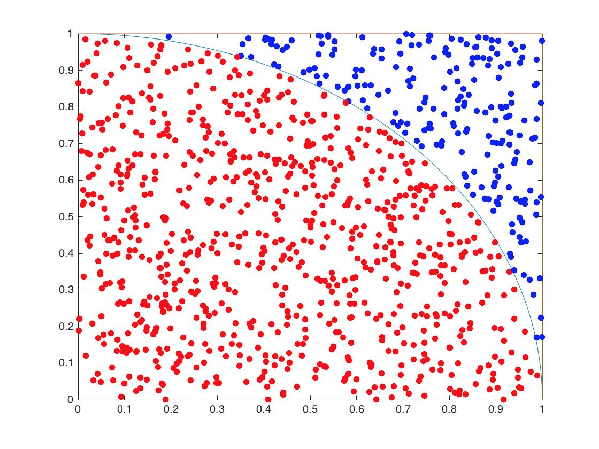
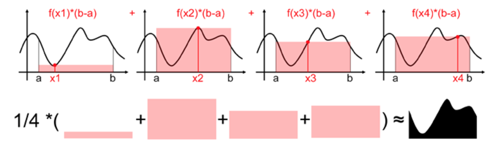

# Monte Carlo Method

> The Monte Carlo method is a numerical method of solving mathematical problems by random sampling (or by the simulation of random variables).

{:toc}

## 概述
[Monte Carlo Method](https://en.wikipedia.org/wiki/Monte_Carlo_method) (MCM)蒙特卡洛方法，是一类随机算法的统称，这些算法的共性是使用重复的随机抽样来进行数值计算。MCM获得的是相应问题的数值近似结果，采样次数越多，越接近真实值，即MCM一定会产出一个结果，且结果是近似的。如Sobol所述：
> The Monte Carlo method is a numerical method of solving mathematical problems by random sampling (or by the simulation of random variables).

与Monte Carlo Method相对应的是[Las Vegas Method](https://en.wikipedia.org/wiki/Las_Vegas_algorithm) (LVM)。LVM同样采用随机算法，但是与MCM不同，LVM的目标是产出准确结果。但是LVM所作的随机性决策有可能导致算法找不到所需的解。最典型的LVM算法是Quick Sort，Quick Sort每次随机选择一个pivot，但是最终总能给出准确的排序结果。

对比MCM和LVM，举个例子，假如筐里有100个苹果，每次闭眼拿1个，挑出最大的。首先随机拿1个，再随机拿1个跟它比，留下大的，再随机拿1个……每拿一次，留下的苹果都至少不比上次的小。拿的次数越多，挑出的苹果就越大，但除非拿100次，否则无法肯定挑出了最大的。这个挑苹果的算法，就属于蒙特卡罗算法——尽量找好的，但不保证是最好的。而拉斯维加斯算法，则是另一种情况。假如有一把锁，给我100把钥匙，只有1把是对的。于是我每次随机拿1把钥匙去试，打不开就再换1把。我试的次数越多，打开（最优解）的机会就越大，但在打开之前，那些错的钥匙都是没有用的。这个试钥匙的算法，就是拉斯维加斯的——尽量找最好的，但不保证能找到。

既然LVM可以给出准确解，为何还需要MCM呢？很多情况下，问题无法无法使用准确的数学/数值计算方法求解，或者求解成本非常高，而MCM可以在有效的时间内给出近似的结果。

为了使用MC算法，我们首先去要进行随机抽样，后面我将详细介绍常见的抽样算法。这里我先介绍两个例子，展示MCM的核心思想。

## 示例1——计算圆周率

为了计算圆周率，我们可以在下图的正方形中随机生成大量的点，落在下图圆弧中的点（图中红色的点）的数量，和总的点的数量的比，我们可以认为是四分之一圆和正方形面积之比。



matlab示例代码如下：
```matlab
totalCount=3000000;
hitCount=0;
for i=1:totalCount
    point=rand(1,2);
    dist=sqrt(point(1)^2+point(2)^2);
    if dist<=1
        hitCount=hitCount+1;
    end
end
estimatedPi=hitCount/totalCount*4
```

## 示例2——计算定积分

设一组随机变量$\{X_i\}$在$[a,b]$上独立同分布，分布律为$f_X$，即$f_X$是随机变量$X$的PDF。令$g^*(x)=\frac{g(x)}{f_X(x)}$，则$g^*(x)$也是一组独立同分布的随机变量。

根据[Law of the unconscious statistician](https://en.wikipedia.org/wiki/Law_of_the_unconscious_statistician)(abbr. LOTUS)可以得到：$$E[g^*(X_i)]=\int_a^bg^*(x)f_X(x)dx=\int_a^bg(x)dx=I$$
根据强大数定理可以得到：$$P_r(\lim_{N \to +\infty} \frac{1}{N} \sum_{i=1}^{N}g^*(X_i)=I)=1$$
即$$\frac{1}{N} \sum_{i=1}^{N}g^*(X_i)$$以概率1收敛至$I$。也就是说，当样本$X$数量足够大，上述均值可以做为期望值。

假设我们所要求的积分为$$I=\int_a^bg(x)d(x)$$，我们任意选择一个方便进行抽样的PDF为$f_X(x)$，使$\int_a^bf_X(x)dx=1$，令$$g^*(x)=\frac{g(x)}{f_X(x)}, \ f_X(x)\neq0$$，那么目标积分可以写成$$I=\int_a^bg^*(x)f_X(x)dx$$，结合上面根据LOTUS推断出的结论，可以得到求积分$I$的具体步骤是：
- 从PDF $f_X$中采样，获取样本集$X_i\ (i=1,2,\cdot\cdot\cdot,N)$
- 计算均值$$\frac{1}{N} \sum_{i=1}^{N}g^*(X_i)$$，做为$I$的近似值。

<br>
特别地，针对$f_X$，我们可以取$[a,b]$上的均匀分布，即$$f_X(x)=\frac{1}{b-a},\ a<=x<=b$$，那么前面所述的$$g^*(x)=\frac{g(x)}{1/b-a}=(b-a)g(x)$$，积分$\int_a^bg(x)dx$就可以通过计算$$\frac{b-a}{N} \sum_{i=1}^{N}g(X_i)$$来获得。

关于均值法计算定积分的直观解释，可以查看[这篇文章](http://www.scratchapixel.com/lessons/mathematics-physics-for-computer-graphics/monte-carlo-methods-in-practice/monte-carlo-integration)。这里简单说一下。在$[a,b]$之间随机取一个点$x_i$，图中暗色部分的面积即为$f(x_i)*(b-a)$，多次取点后的面积平均值即为所求积分。



